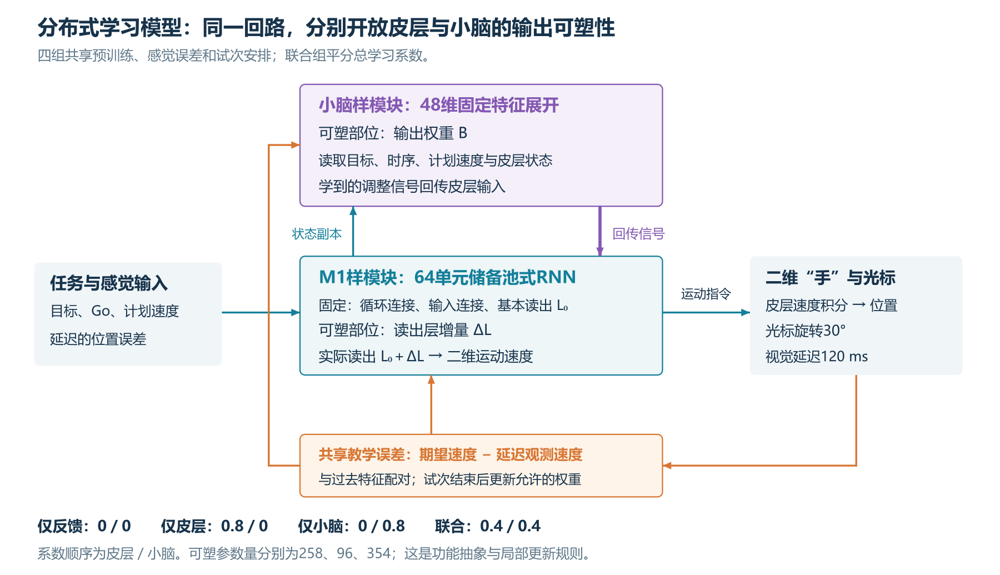
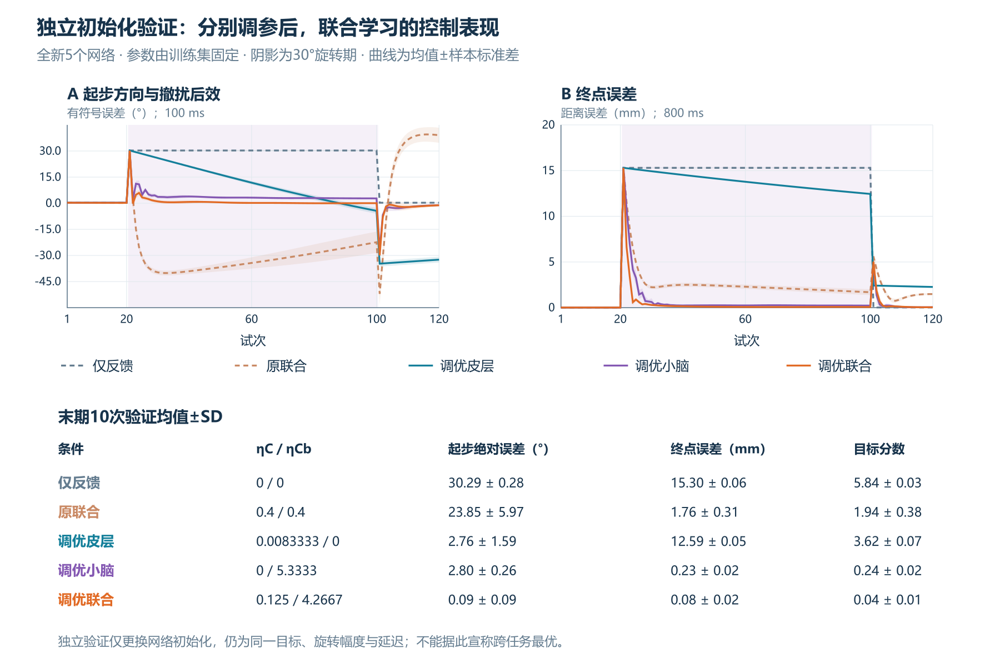

# 皮层—小脑双模块学习：反馈、适应与学习系数搜索

本仓库是一项教学性计算实验：用两个相互连接的功能模块，研究当前反馈纠偏如何与跨试次学习配合，并检验两处更新尺度怎样影响控制效果。它是独立实现的工程模型，不是人体脑区的细胞级复现。

## 核心问题与模型

- **M1样模块**：64单元储备池RNN，基本控制读出预训练；适应阶段只学习读出增量，循环与输入连接固定。
- **小脑样模块**：48维固定特征展开，学习输出权重；调节信号回传M1样模块输入。
- **身体与反馈**：二维运动点只接收M1样模块的最终速度；视觉延迟120毫秒。
- **学习规则**：延迟速度跟踪误差与保存的早期特征配对，试次结束后归一化更新。位置误差用于当前动作纠偏。



图中系数是原四组实验的总系数匹配设置；后续优化分别搜索两个系数，允许总和改变。

## 主要结果

五个调参网络搜索286组组合，随后固定系数，对五个未参与调参的新初始化运行完整适应任务。最佳已测联合组合为 **ηC=0.125，ηCb=4.26666667**。

| 新初始化验证条件 | 末期绝对起步误差 | 末期终点误差 |
|---|---:|---:|
| 原联合0.4／0.4 | 23.85° | 1.76 mm |
| 调优小脑单模块 | 2.80° | 0.23 mm |
| 调优联合 | 0.09° | 0.08 mm |



每个验证初始化中，调优联合相对调优小脑的末期方向、终点及综合目标均改善。撤除任一处学到的输出作用，两项误差都增大，支持当前检查点下的协作。

**结论范围**：这是当前任务、评价目标、筛查及已测参数中的较优组合。两个模块的参数预算和有效更新尺度未匹配；皮层单模块选择受峰值误差筛查明显影响；未训练方向终点仍约11毫米。系数比例不代表生物学习速度比例。

## 快速使用

模型与校验只需Python和NumPy。记录的环境为Python 3.12.14、NumPy 2.3.5；优先使用Python 3.11或更新版本。

```text
python -m pip install -r requirements.txt
python tools/reproduce.py --mode verify
```

`verify`运行单元测试、发布检查点重放及数据独立核对，不重新搜索。发布包自带结果和PNG，可以直接阅读。

从头训练与完整复现：

```text
python tools/reproduce.py --mode full
```

新结果写入`reproduced/`，保留发布数据。该模式重新拟合全部基本控制器、进行原四组实验、286组搜索及新初始化验证，并比较新旧CSV；同时生成SVG。搜索范围扩展依训练结果决定，协议和固定选择均保留。

只检查模型行为：

```text
python tools/reproduce.py --mode smoke
```

PNG已提供；重渲染PNG是可选操作，另需Node.js：

```text
npm install
npm run render
```

数值复现按容差检查，不承诺不同操作系统和数值库逐位一致。详见[运行说明](docs/REPRODUCIBILITY.md)。

2026-10-07已在独立目录运行完整复现，重新训练基本控制器并完成搜索与验证。六项模型测试通过，十份CSV的数值与发布数据一致，选择的系数一致。环境及比较记录见[复现检查记录](docs/reproduction_check.json)；这是当前环境的实测结果。

## 阅读与文件

- [模型结构、公式与原四组实验](docs/MODEL.md)
- [双系数目标、搜索、筛查、验证与局限](docs/TUNING.md)
- [AI辅助范围与作者确认](docs/AI_ASSISTANCE.md)
- [相关论文链接](docs/REFERENCES.md)
- `experiments/distributed/results`：原四组2400次试次、探测、系数扫描和检查点。
- `experiments/distributed/tuning/results`：搜索记录、3000次独立初始化验证、250次探测及逐种子差值。
- `tests/`：门控、输出路径、学习开关与反馈前信息隔离测试。

公开包只含独立实验及自绘图，未包含私人课程报告、身份信息、论文PDF、论文原图或历史聊天。论文以链接引用。

## 使用与发布状态

许可证由作者在正式发布前确认；当前整理包未附代码授权许可证。引用结果时请同时说明模型假设、筛查和任务范围，勿作为人体脑区能力排名。
