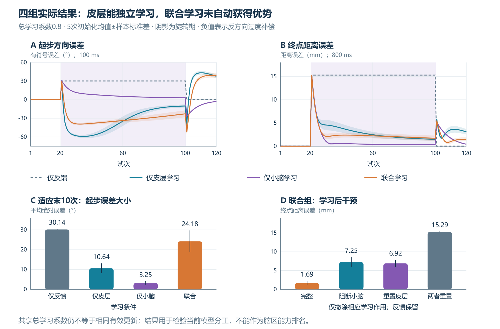
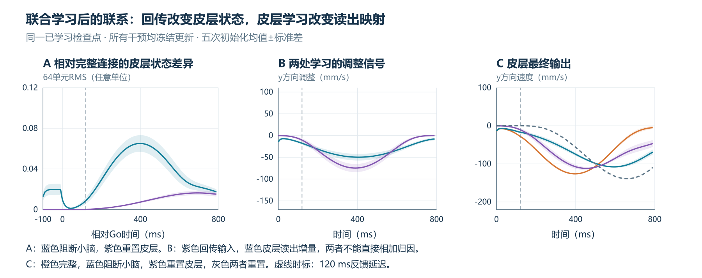
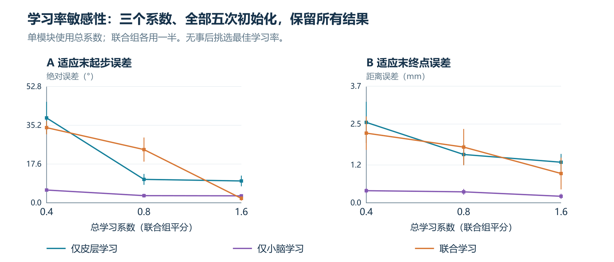

# 皮层、小脑与联合学习：四组分布式可塑性实验

## 后续：分别优化两个学习系数

本页保留总系数匹配的原四组协议与数据。最新[双系数搜索与独立初始化验证](TUNING.md)在相同模型中分别调节两处更新系数，训练集搜索286组，再冻结选择并验证五个新初始化。最佳已测联合组合为0.125／4.26666667，验证末期绝对起步误差0.091°、终点0.081毫米；两处学习作用撤除后均变差。系数总和允许变化，故与本页原协议区分，不将改善只归因于联合学习。目标、筛查及方向泛化限制见新页。

## 这次新增了什么

此前双模块实验在适应阶段固定皮层，学习只发生在小脑输出层。本轮允许皮层读出层也学习，比较“仅反馈、仅皮层学习、仅小脑学习、联合学习”四组，再用回传阻断和皮层学习增量重置，观察哪些调整被保留。

为比较不同大小的特征表示，两处输出更新均作特征能量归一化，联合组平分总学习系数。模型为独立功能实现，未复现文献的完整网络。

## 1. 架构与可塑部位

每个种子先监督训练同一个64单元储备池式RNN，形成基本到达与反馈纠偏能力。其循环连接、输入连接、偏置及预训练基本读出L₀保持固定。皮层适应由额外读出增量ΔL承担：实际读出为L₀＋ΔL。它读取当前、前一时刻的64维活动和一个常数，共129维特征，输出二维速度，故有258个可塑参数。

小脑模块延续48维固定背景展开，输入目标、计划速度、时序与皮层状态投影。输出权重B产生二维调整信号，回传皮层输入；共96个可塑参数。背景特征按计划速度大小门控。运动点只接收皮层最终速度。

本模型皮层可塑性仅位于读出层，并未开放循环连接，也未复现Feulner原文循环连接更新。小脑模块借鉴背景表示和可塑性输出，未建立PC、CF、核团细胞及具体突触机制。两个模块均是功能抽象。

## 2. 四组如何比较

| 条件 | 皮层增量ΔL | 小脑输出B | 主实验更新系数 | 可塑参数数 |
|---|---|---|---|---:|
| 仅反馈 | 冻结为零 | 冻结为零 | 0／0 | 0 |
| 仅皮层学习 | 开启 | 冻结为零 | 0.8／0 | 258 |
| 仅小脑学习 | 冻结为零 | 开启 | 0／0.8 | 96 |
| 联合学习 | 开启 | 开启 | 0.4／0.4 | 354 |

四组共享相同预训练和固定特征映射、目标、反馈、误差定义及120次试次安排。每组从相同基本控制器开始，两个学习增量均重置为零。全部5个种子为11、22、33、44、55。

总更新系数匹配，防止联合组直接得到两倍系数；但它不等于参数数量、有效函数变化或输入—输出敏感度匹配。皮层读出调整直接改变输出，小脑回传则先经过RNN。两条路径不可按权重范数或速度信号大小直接作贡献比例相加。

## 3. 任务和学习公式

二维运动点在0.8秒内向100毫米目标移动，控制步长10毫秒；显示坐标在适应阶段旋转30°，视觉延迟120毫秒。各组经历20次基线、80次旋转和20次撤扰。撤扰后继续按该组规则学习。

当前纠偏使用期望位置与延迟观测位置之差。学习使用已完成运动段的期望速度减去延迟观测速度：

$
e_j=\tilde v_{ref,j}-\tilde v_{obs,j}
$

位置以100毫米、速度以125毫米/秒归一化。下文e和输出调整均在归一化单位中计算。

设皮层读出特征为q，小脑背景特征为φ。第n次运动结束后：

$
\Delta L_{n+1}=0.999\Delta L_n+
\frac{\eta_C}{80}\sum_{j\in\mathcal A}
\frac{q_j e_j^T}{\max(0.1,\Vert q_j\Vert^2)}
$

$
B_{n+1}=0.999B_n+
\frac{\eta_B}{80}\sum_{j\in\mathcal A}
\frac{\phi_j e_j^T}{\max(0.1,\Vert\phi_j\Vert^2)}
$

仅对开启学习的模块应用保留和更新；冻结模块保持原参数。ΔL的保留衰减不作用于预训练L₀，因此不会以该操作消除基本控制能力。

两处都采用保存的早期特征与晚到误差配对：控制时刻i的最新可用段为j=i−12−1，主任务在最后控制时刻共收到67段教学信息。权重在运动过程中保持固定，更新在试次末应用；没有额外等待以使用尚未到达的尾段误差。

误差投影使用固定单位映射，没有读取真实旋转角，也未计算完整闭环梯度。该规则是局部相关式近似更新；功能路径、特征尺度和时序均可能影响它的效果。误差参照是期望轨迹，本模型没有独立感觉结果预测器。

## 4. 主实验结果

适应末10次、5次初始化的均值±样本标准差如下。起步方向在100毫秒测量，早于120毫秒感觉反馈；终点在800毫秒测量。标准差描述网络初始化差异，未作生物群体推断或显著性检验。

| 条件 | 绝对起步误差 | 有符号起步误差 | 终点误差 |
|---|---:|---:|---:|
| 仅反馈 | 30.14±0.27° | ＋30.14° | 15.29±0.10 mm |
| 仅皮层学习 | 10.64±2.48° | −10.64° | 1.53±0.32 mm |
| 仅小脑学习 | 3.25±0.85° | ＋3.25° | 0.35±0.09 mm |
| 联合学习 | 24.18±5.48° | −24.18° | 1.77±0.58 mm |

皮层单独学习能够改变反馈到达前的输出并改善终点。主设置下，小脑组两项误差较小；皮层组和联合组则出现反方向起步过度补偿。联合组某个种子的起步误差还大于仅反馈组，所有种子均保留。

在主系数0.8下，学习组速度跟踪RMSE也明显低于仅反馈组：仅反馈约54.02毫米/秒，皮层6.64、小脑2.39、联合6.97。这说明模型的总体轨迹跟踪改善可以与起步方向过度补偿同时存在，不能只用终点或一个平均损失代表全过程质量。

撤扰首试次起步误差均值分别为0.14°、−40.12°、−26.84°、−52.49°。此后皮层和联合组还出现正方向反弹。该动态是当前模型的输出，并未拟合人体撤扰曲线，也不应被解释为已验证的生物快慢学习过程。

## 5. 学习后的干预：补偿保留在哪里

每组从适应末第100次更新后的同一个检查点开始探测，所有探测均冻结学习：

- 阻断小脑：回传信号置零，B权重保留。
- 重置皮层：暂时使ΔL不参与输出，保留L₀和皮层网络活动。这是撤除模型中的学习增量，不是破坏M1。
- 两者重置：同时撤除两处学到的输出作用，基本反馈控制仍在。

联合组探测结果：

| 条件 | 有符号起步误差 | 终点误差 |
|---|---:|---:|
| 完整模型 | −22.49° | 1.69 mm |
| 阻断小脑回传 | −19.15° | 7.25 mm |
| 重置皮层学习增量 | ＋24.69° | 6.92 mm |
| 同时撤除两者 | ＋30.14° | 15.29 mm |

阻断小脑后，皮层学到的输出仍保留，因而不会像旧版“只有小脑学习”时回到原始起步方向；它仍存在过度补偿，终点也变差。分别撤除任一处输出，终点均劣于完整联合模型，表明在这一检查点，两处调整共同支持终点跟踪。两者同时撤除，轨迹精确恢复预训练反馈基线。

皮层单独组阻断小脑时行为不变；小脑单独组重置皮层增量时行为不变。这两项空干预也经过实际验证。

## 6. 活动状态和输出映射要分开看

A比较完整模型与干预时的64单元皮层状态差异。小脑回传改变网络输入，因而在准备期就可改变皮层状态。皮层学习只改读出层，重置ΔL时，反馈到达前的内部状态保持相同，但输出已可不同；其运动差异经过感觉反馈，随后再影响皮层状态。

B分别展示小脑输入位置的回传信号，以及皮层输出位置的读出增量。两者经过不同功能路径，不能直接相加作为因果贡献分解。C展示四种干预下的最终皮层速度。准备期给予计划速度预览并由Go门控保持身体静止，活动差异受这一设计约束。

这些状态为人工单元活动、单位任意，未拟合神经放电、皮层群体流形或实验解码结果。

## 7. 学习系数敏感性与方向迁移

预先设置0.4、0.8、1.6三个总系数，全部使用相同5次初始化，不按结果选择主实验系数。联合组始终平分总系数。

| 总系数 | 皮层：绝对起步／终点 | 小脑：绝对起步／终点 | 联合：绝对起步／终点 |
|---:|---:|---:|---:|
| 0.4 | 38.55°／2.55 mm | 5.80°／0.39 mm | 34.14°／2.21 mm |
| 0.8 | 10.64°／1.53 mm | 3.25°／0.35 mm | 24.18°／1.77 mm |
| 1.6 | 9.92°／1.29 mm | 3.17°／0.21 mm | 2.00°／0.93 mm |

较大系数下，联合组起步误差低于小脑组，但终点仍较大；较小系数下，皮层和联合组有明显起步过度补偿。因此，“哪一组更好”依赖参数和评价指标，而不宜归结为某脑区天然更强。

未训练方向−45°、＋45°的主系数联合组终点误差分别为12.11、10.11毫米，部分方向的起步改善没有转化为同等终点改善。主系数联合组关闭反馈时终点误差1.61毫米，略低于完整反馈的1.69毫米，说明未为联合控制专门再训练的反馈也未必在每个指标上增益；没有对此作显著性结论。

全部组还测试了60／180毫秒延迟和每坐标1毫米标准差观测噪声。结果保留于`probe_metrics.csv`；噪声每个种子仅一条轨迹，属于初步压力测试。60毫秒延迟下的100毫秒方向读数可能包含反馈，不能解释为纯前馈输出。

## 8. 可得结论与仍待解决的问题

本模型展示：皮层读出可塑性和小脑输出可塑性都能形成适应；学习作用可以分布在两处；分别撤除其输出有不同后果。联合开放学习并不自动形成优于单模块的控制，需要匹配更新尺度、功能路径和优化目标。

当前不能判定联合组过度补偿的唯一原因。可能涉及读出偏置、特征的速度门控差异、近似误差投影及共同误差下的更新相互作用。这些解释尚需各自的消融测试，不能把“模块干扰”写成已证实原因。

下一步优先加入“运动开始时速度约束／更合适的时间信用分配”等对照，检验早期方向与全程跟踪是否可同时改善；再开放皮层循环连接可塑性。固定系数总和不等于参数预算匹配，本轮没有据此证明双模块优于同参数量单RNN，更没有建立人体脑区能力排名。

## 文件与复现

从仓库根目录运行`python tools/reproduce.py --mode full`可重新训练、搜索、验证及生成SVG。仅检查发布数据可运行`python tools/reproduce.py --mode verify`。依赖为NumPy 2.3.5。

- `model_core.py`：固定网络结构、基本控制预训练及共享特征映射。实验代码位于`experiments/distributed`。
- `distributed_simulation.py`：四组适应、学习后探测及系数扫描。
- `results/trial_metrics.csv`：5×4×120＝2400条主试次记录。
- `results/probe_metrics.csv`：5×4×10＝200条探测记录。
- `results/rate_sensitivity.csv`：三个系数、三种学习条件、五个种子，共45条汇总。
- `results/checkpoint_*.npz`：各条件适应末检查点。
- `results/activity_*.npz`：准备与运动状态、回传、输出和光标轨迹。
- `results/summary.json`：均值、标准差及逐种子数值。
- `verify_simulation.py`与`results/independent_validation.json`：检查点重放、参数冻结、无未来信息泄漏、仅皮层输出驱动身体及双重置恢复基线检查。

文献入口：[Feulner等：反馈驱动RNN学习](https://doi.org/10.1038/s41467-024-54738-5)、[Israely等：小脑输出与皮层准备](https://doi.org/10.1038/s41467-025-57832-4)、[Nguyen与Person：小脑预测控制](https://doi.org/10.1038/s41583-025-00936-z)、[Tseng等：学习信息的行为鉴别](https://doi.org/10.1152/jn.00266.2007)。本实验未复现其中任一完整网络或生物实验。
