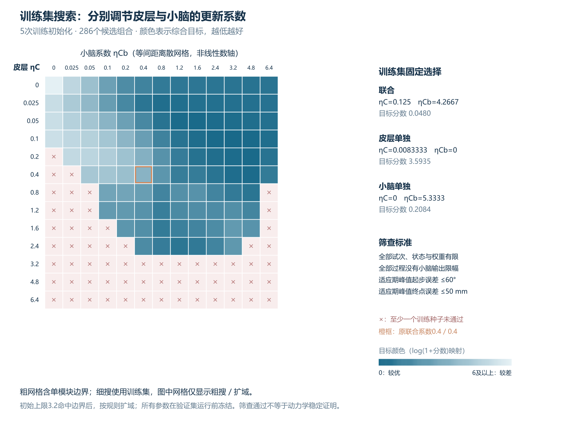
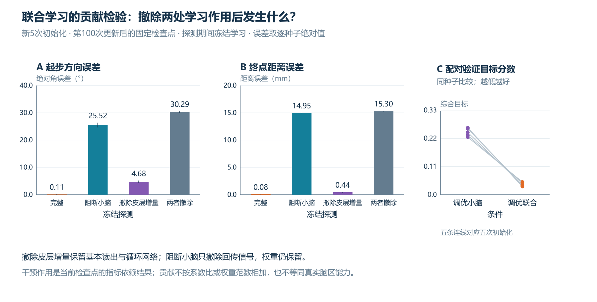

# 两个学习系数的搜索与独立初始化验证

## 结论先看

本任务中，分别调节两处更新系数后，联合方案获得了比原来平均分配系数更好的控制表现。最佳已测联合组合为 **ηC＝0.125，ηCb＝4.26666667**。冻结这组系数，再对五个新初始化的网络运行完整适应任务，末期起步绝对误差为 **0.091±0.087°**，终点误差为 **0.081±0.021毫米**。

这回答的是“怎样为当前两个计算路径分配更新尺度”，而非人体皮层和小脑的最优学习速度。两条路径的特征、归一化和输入—输出作用不同，系数比约34不能解释成学习快34倍。两处保留率仍相同，均为0.999。

## 1. 什么保持不变，什么被优化

沿用[四组模型及公式](MODEL.md)：64单元M1样储备池RNN，循环、输入连接及基本读出L₀固定；皮层只更新读出增量ΔL。小脑样模块有48维固定背景特征，只更新输出B，回传皮层输入。身体仍只接收皮层最终速度。两处教学信号均为保存的早期特征与延迟速度跟踪误差的相关，试次结束后更新。

这次只改变ηC和ηCb，允许总和及分配比例改变。因此它是控制器调优，**不再要求所有条件总系数相同**；不能将改善仅归因于“增加了联合学习”。任务仍为20次基线、80次30°视觉旋转、20次撤扰，目标100毫米、时长800毫秒、延迟120毫秒。基线与撤扰期间也按各自规则学习。

## 2. “最优”如何定义

搜索前固定以下综合目标，越低越好：

$
J=\frac14\left(\frac{E_{late}}{5^{\circ}}+
\frac{D_{late}}{1\,\mathrm{mm}}+
\frac{E_{adapt}}{30^{\circ}}+
\frac{D_{adapt}}{15.3\,\mathrm{mm}}\right).
$

E为100毫秒时的绝对起步方向误差，D为800毫秒终点距离误差；late取末10次适应，adapt取全部80次适应。这兼顾最后精度与学习过程中累计表现；全适应均值是过程代价，未拟合学习时间常数。末10次同时进入两类均值，体现了对末期精度的额外重视。归一化尺度与等权重是本次分析的实际取舍，不是神经科学定律。

候选还须在全部五个调参初始化中通过预设筛查：全部120次状态、学习权重与指标有限；全程无小脑输出限幅；适应期峰值绝对起步误差≤60°、终点误差≤50毫米。正常撤扰后效单独保留，不应用适应期上界。**通过筛查表示满足这些有限检查，不构成动力学稳定证明。**

训练种子为11、22、33、44、55；按平均J选择全域、两系数均正的联合、皮层单独、小脑单独四类的最佳已测候选。保留单模块边界，避免先假定联合应获胜。

## 3. 搜索流程与验证隔离



初始两系数各取0、0.025、0.05、0.1、0.2、0.4、0.8、1.2、1.6、2.4、3.2，共121组。只看训练结果时，联合和小脑方案命中3.2上限。此时尚未生成验证网络；按记录的训练阶段修订，条件扩域至4.8、6.4，新增48组。扩域规则允许继续倍增至25.6，但本次无需继续，最终最佳均位于6.4上限以内。

随后对前三个联合候选作7×7局部细搜，对两个单模块作13点细搜，去掉重复组合后新增117组。共 **286组×5初始化×120次＝171600次调参试次**。所有搜索、局部细化、筛查与选择只使用这五个初始化；目标权重和筛查阈值没有随结果改动。范围修订在`protocol.json`明示，扩域修订在参数协议中说明；完整粗搜、扩域、细搜结果均已提供。

系数冻结后，才生成66、77、88、99、110五个新初始化。它们仍各自从基本预训练网络开始进行完整适应，因此是**学习系数的独立初始化验证**，不是所有连接权重冻结的零样本测试。五个条件共3000次试次，另250次学习后探测。验证后没有再改系数。

## 4. 新初始化结果


两项末期误差取末10次平均；表中均值±样本SD描述五个新网络的差异，J按前述综合公式计算。全部条件均有5／5个验证初始化通过上述筛查。

| 条件 | ηC／ηCb | 绝对起步误差（°） | 终点误差（mm） | 综合J |
|---|---|---:|---:|---:|
| 仅反馈 | 0／0 | 30.291±0.276 | 15.301±0.059 | 5.842±0.026 |
| 原联合 | 0.4／0.4 | 23.85±5.97 | 1.76±0.31 | 1.94±0.38 |
| 筛查约束下调优皮层 | 0.00833333／0 | 2.76±1.59 | 12.59±0.05 | 3.62±0.07 |
| 调优小脑 | 0／5.33333333 | 2.803±0.256 | 0.235±0.021 | 0.24±0.02 |
| 调优联合 | 0.125／4.26666667 | 0.091±0.087 | 0.081±0.021 | 0.04±0.01 |

联合相对调优小脑的末期起步、终点和J在**每个验证初始化**中均改善，逐种子配对差值保存在`test_paired_differences.csv`。这支持当前任务、目标及已测系数范围内联合方案的优势，尚无群体生物推断，也没有证明全局最优。

皮层行必须结合筛查阅读：筛查迫使它选择较小更新系数，终点误差较大；这不是皮层模型能力上限。若仅要求有限且无限幅、移除行为峰值门槛，训练已测描述性最佳如下；它们只用于说明筛查影响，**没有取代主选或据验证重新挑参**。

| 条件 | 筛查通过最佳ηC／ηCb：训练末期角度／终点 | 仅有限且无限幅最佳：训练末期角度／终点 |
|---|---|---|
| 皮层 | 0.00833333／0：2.36°／12.56 mm | 4.8／0：5.77°／1.14 mm |
| 小脑 | 0／5.33333333：2.25°／0.23 mm | 同左 |
| 联合 | 0.125／4.26666667：0.23°／0.08 mm | 同左 |

皮层4.8候选的五个训练初始化峰值角误差为64.93–74.02°，均超过60°。此处“描述性最佳”仅在同一已测候选集内成立，搜索的细化仍围绕主筛查选择，未另做无门槛的完整优化。

## 5. 联合是否实质用了两个模块



从每个调优联合网络第100次更新后的固定检查点开始，冻结学习再探测：

| 探测 | 逐种子绝对起步误差的均值 | 终点误差均值 |
|---|---:|---:|
| 完整 | 0.105° | 0.078 mm |
| 阻断小脑回传 | 25.517° | 14.953 mm |
| 撤除皮层读出增量ΔL | 4.678° | 0.438 mm |
| 同时撤除两处学习作用 | 30.291° | 15.301 mm |

在全部五个验证初始化中，撤除任一处学到的输出作用都增加两项误差，说明皮层作用并非只是“系数非零”。两处学习在这个检查点共同支持准确性；撤除效果具有闭环相互依赖，不能相加为贡献百分比。撤除皮层增量仍保留基本控制网络，不等同M1损毁。

探测完整值与末10次均值是不同测量：0.105°／0.078毫米对应更新后的单次冻结检查点，0.091°／0.081毫米对应前述末10次平均。

## 6. 泛化与结论边界

未训练的−45°、＋45°目标方向，调优联合探测终点仍为11.10、10.77毫米。当前验证证明的是换新网络初始化后同一任务的表现，**方向泛化仍弱**。60／180毫秒延迟、1毫米观测噪声及关闭反馈的冻结探测也已保留；噪声每网络仅一条轨迹，未测试带噪学习。

调优联合相对其他方案还具有不同系数总和；皮层、小脑和联合可塑参数量分别为258、96、354，仍未匹配参数预算或有效函数更新。系统只是两条局部更新路径的功能模型，没有PC／CF细胞、脊髓或真实手臂动力学；未复现原文全网络与生物实验。

最明确的工程启发是：**多模块同时学习时，应分别匹配更新尺度，并用新初始化和撤除实验检验是否真正协作。** 当前搜索给出可复验的较优系数组合，也暴露方向迁移限制；它没有建立人体脑区能力排名或普遍的快慢分工规律。

## 7. 复现与检查

从仓库根目录运行：

```text
python experiments/distributed/tuning/tune_learning.py --phase all
python experiments/distributed/tuning/verify_tuning.py
python experiments/distributed/tuning/render_tuning.py
```

需NumPy；模型文件位于`experiments/distributed`，调参脚本及默认结果位于其`tuning`子目录。直接运行脚本可复用原四组预训练检查点，新预训练权重缓存在`tuning/results/pretrained`；添加`--retrain-pretraining`可忽略缓存从头拟合。仅重跑独立初始化验证可使用`--phase test`，它读取既有的冻结选择。

- `protocol.json`：固定目标、筛查、搜索规则及训练阶段扩域修订。
- `search_per_seed.csv`、`search_aggregate.csv`：286组逐种子及均值结果。
- `frozen_selection.json`：验证前的固定选择、范围及无峰值门槛描述性候选。
- `test_trials.csv`、`test_probes.csv`、`test_summary.json`：3000次验证与250次探测。
- `test_paired_differences.csv`、`probe_paired_changes.csv`：逐种子对照和撤除效应。
- `pareto_candidates.csv`：四个误差指标下的29个训练集非支配候选，显示目标取舍。
- `checkpoint_*.npz`、`activity_*.npz`：检查点、输出、准备与运动状态。
- `batch_validation.json`：120试次批量与标量最大指标差约2.2×10⁻¹³，权重差约3.4×10⁻¹⁶，限幅计数相同。
- `independent_validation.json`：独立重算选择和均值、250次探测重放、权重冻结、输出路径、反馈前无旋转泄漏及新旧种子隔离。

关键方法与结果解释使用Astra辅助审查；AI辅助范围与作者确认要求见[辅助说明](AI_ASSISTANCE.md)。发布包保留原四组及调优结果，未包含私人课程稿、论文原图或历史制作文件。
